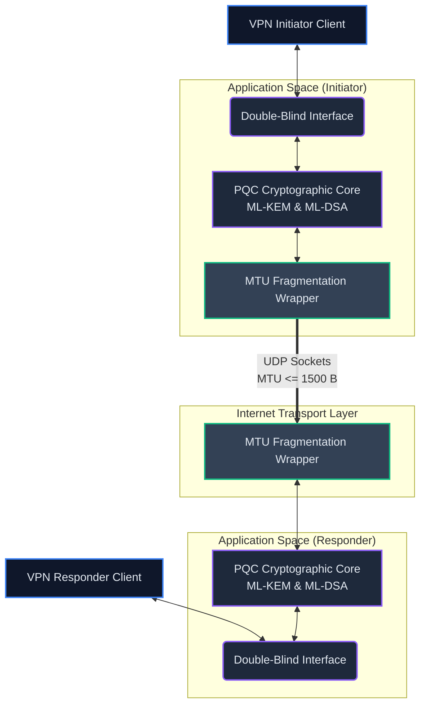
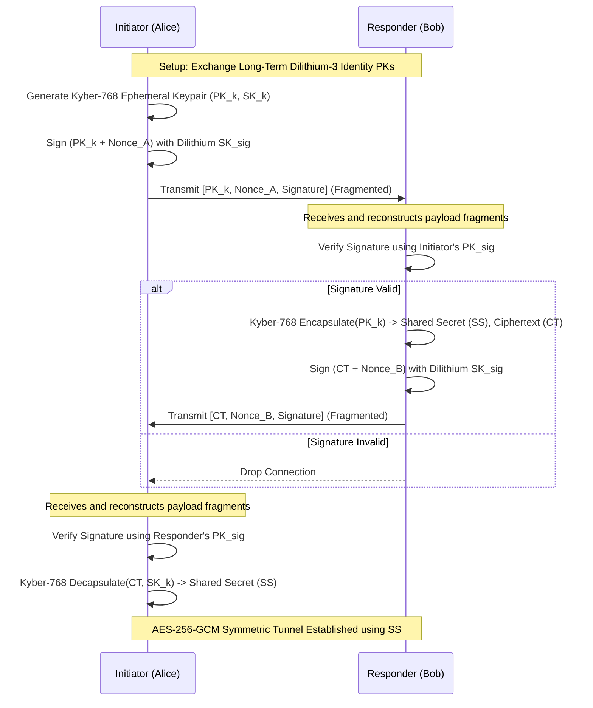
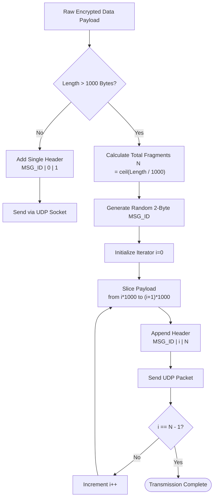

# Double-Blind PQC Diagrams

Here are the fixed Mermaid.js diagrams. Render these using the [Mermaid Live Editor](https://mermaid.live/) and export them as PNGs. In Overleaf, upload the PNGs and use `\includegraphics{filename.png}` under the respective placeholders in your `paper.tex` file.

## Diagram 1: System Architecture Overview
Place this diagram right above the **"Step 1: Initiation and Identity Assertion"** section (in Overleaf, search for `% PLACEHOLDER POINT 1`).

## Diagram 2: Handshake Sequence Diagram
Place this diagram right after **Algorithm 1: Double-Blind Handshake & Encapsulation** (in Overleaf, search for `% PLACEHOLDER POINT 2`). If no placeholder is found explicitly, place it directly underneath algorithm 1.

## Diagram 3: MTU Fragmentation Logic Flowchart
Place this diagram right after **Algorithm 2: Deterministic MTU Payload Extractor** (in Overleaf, search for `% PLACEHOLDER POINT 3`).

